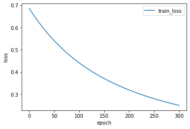
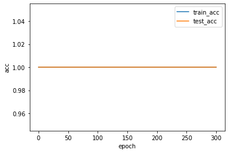
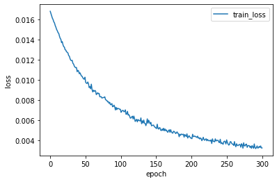
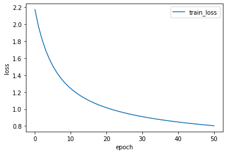
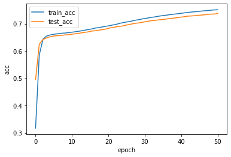
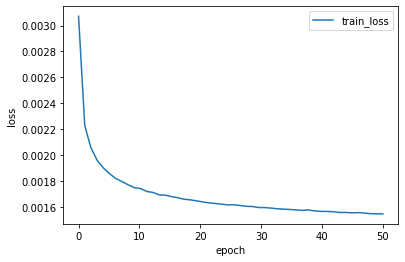

一、Pytorch基本操作考察

1. 使用 𝐓𝐞𝐧𝐬𝐨𝐫 初始化一个 𝟏 × 𝟑 的矩阵 𝑴 和一个𝟐 × 𝟏 的矩阵 𝑵，对两矩阵进行减法操作（要求实现三种不同的形式），给出结果并分析三种方式的不同（如果出现报错，分析报错的因），同时需要指出在计算过程中发生了什么


```python
import torch
```


```python
m = torch.Tensor([[1,2,3]])
n = torch.Tensor([[5],[6]])
```


```python
print(m - n)
```

    tensor([[-4., -3., -2.],
            [-5., -4., -3.]])
    

Broadcasting能够实现Tensor自动维度增加（unsqueeze）与维度扩展（expand），以使两个Tensor的shape一致，如果 x 和 y 的维度不同，那么对于维度较小的 tensor 的维度补 1，使它们维度相同。
然后，对于每个维度，计算结果的维度值就是 x 和 y 中较大的那个值。
因此相减结果的维度应该是[2,3]，m被扩充成[[1,2,3],[1,2,3]]，n被扩充成[[5,5,5],[6,6,6]]


```python
print(m.shape)
print(n.shape)
print((m-n).shape)

```

    torch.Size([1, 3])
    torch.Size([2, 1])
    torch.Size([2, 3])
    


```python
print(torch.sub(m, n))
```

    tensor([[-4., -3., -2.],
            [-5., -4., -3.]])
    


```python
print(m)
```

    tensor([[1., 2., 3.]])
    

torch.sub()和减法的效果一致，且被减数不变


```python
m.sub_(n)
print(m)
```


    ---------------------------------------------------------------------------

    RuntimeError                              Traceback (most recent call last)

    e:\deeplearning_wanhuaiyu_2022\homework\lab1\lab1.ipynb Cell 11' in <cell line: 1>()
    ----> <a href='vscode-notebook-cell:/e%3A/deeplearning_wanhuaiyu_2022/homework/lab1/lab1.ipynb#ch0000007?line=0'>1</a> m.sub_(n)
          <a href='vscode-notebook-cell:/e%3A/deeplearning_wanhuaiyu_2022/homework/lab1/lab1.ipynb#ch0000007?line=1'>2</a> print(m)
    

    RuntimeError: output with shape [1, 3] doesn't match the broadcast shape [2, 3]


torch.sub_()功能与torch.sub()相同，区别在与torch.sub_()是torch.sub()的in-place操作版本。
in-place 操作是直接改变给定线性代数、向量、矩阵(张量)的内容而不需要复制的运算。
减法操作的结果的形状是[2,3]，而被减数m的形状是[1,3]，两个形状不一样所以报错了。无法赋值一个形状为[2,3]的数给m。

2. ① 利用 𝐓𝐞𝐧𝐬𝐨𝐫 创建两个大小分别 𝟑 × 𝟐 和 𝟒 × 𝟐 的随机数矩阵 𝑷 和 𝑸 ，要求服从均值为0，标准差0.01为的正态分布；② 对第二步得到的矩阵 𝑸 进行形状变换得到 𝑸 的转置 𝑸𝑻 ；③ 对上述得到的矩阵 𝑷 和矩阵 𝑸𝑻 求矩阵相乘


```python
p = torch.Tensor(3,2)
q = torch.Tensor(4,2)
torch.nn.init.normal_(p,mean=0, std=0.01)
torch.nn.init.normal_(q,mean=0, std=0.01)
print(p)
print(q)
```

    tensor([[ 0.0066,  0.0102],
            [-0.0073, -0.0031],
            [-0.0065, -0.0011]])
    tensor([[ 0.0084,  0.0104],
            [ 0.0025, -0.0048],
            [ 0.0063,  0.0234],
            [ 0.0151,  0.0079]])
    


```python
torch.transpose(q,dim0=0,dim1=1)
torch.mm(p,q)
```


    tensor([[ 1.6117e-04, -3.1666e-05,  2.7953e-04,  1.8049e-04],
            [-9.3779e-05, -3.9214e-06, -1.1848e-04, -1.3533e-04],
            [-6.5489e-05, -1.1341e-05, -6.5738e-05, -1.0617e-04]])


3. 给定公式 $𝑦_3 = 𝑦_1 + 𝑦_2 = 𝑥^2 + 𝑥^3$，且 𝑥 = 1。利用学习所得到的Tensor的相关知识，求𝑦3对𝑥的梯度，即$\frac{d y_{3}}{d x}$。
要求在计算过程中，在计算 𝑥3 时中断梯度的追踪，观察结果并进行原因分析提示, 可使用 with torch.no_grad()， 举例:
with torch.no_grad():
y = x * 5


```python
x = torch.tensor([1.0],requires_grad=True)
y1 = x * x
y2 = x * x * x
print(y2.requires_grad)
y3 = y1 + y2
y3.backward()
print(x.grad)
```

    True
    tensor([5.])
    

不中断梯度跟踪，$\frac{d y_{3}}{d x}=2x+3x=5x$，当x=1时，计算结果为5


```python
x = torch.tensor([1.0],requires_grad=True)
y1 = x * x
y2 = x * x * x
print(y2.requires_grad)
with torch.no_grad():
    y2 = x * x * x
    print(y2.requires_grad)
    print(y2.grad_fn)
y3 = y1 + y2
y3.backward()
print(x.grad)
```

    True
    False
    None
    tensor([2.])
    


```python
x = torch.tensor([1.0],requires_grad=True)
y1 = x * x
y2 = x * x * x
print(y2.requires_grad)
with torch.no_grad():
    y2 = x * 5
    print(y2.requires_grad)
    print(y2.grad_fn)
y3 = y1 + y2
y3.backward()
print(x.grad)
```

    True
    False
    None
    tensor([2.])
    

因为y2中断了梯度的跟踪，所以无论y2值怎么算，梯度只返回$x^2$的梯度计算结果，即：2x，当x=1时结果为2

二、动手实现 logistic 回归

1. 要求动手从0实现 logistic 回归（只借助Tensor和Numpy相关的库）在人工构造的数据集上进行训练和测试，并从loss以及训练集上的准确率等多个角度对结果进行分析
（可借助nn.BCELoss或nn.BCEWithLogitsLoss作为损失函数，从零实现二元交叉熵为选作）


```python
import numpy as np
%matplotlib inline
from matplotlib.colors import ListedColormap
import torch
import matplotlib.pyplot as plt
```


```python
n_data = torch.ones(100, 2) # 数据的基本形态
x1 = torch.normal(2 * n_data, 1) # shape=(100, 2)
y1 = torch.zeros(100) # 类型0 shape=(100, 1)
x2 = torch.normal(-2 * n_data, 1) # shape=(100, 2)
y2 = torch.ones(100) # 类型1 shape=(100, 1)
# 注意 x, y 数据的数据形式一定要像下面一样 (torch.cat 是合并数据)
x = torch.cat((x1, x2), 0).type(torch.FloatTensor)
y = torch.cat((y1, y2), 0).type(torch.FloatTensor)
```


```python
index = 80
train_x = torch.cat((x1[:index], x2[:index]), 0).type(torch.FloatTensor)
train_y = torch.cat((y1[:index], y2[:index]), 0).type(torch.FloatTensor)
test_x = torch.cat((x1[index:], x2[index:]), 0).type(torch.FloatTensor)
test_y = torch.cat((y1[index:], y2[index:]), 0).type(torch.FloatTensor)
print(train_x.shape,train_y.shape,test_x.shape,test_y.shape)
```

    torch.Size([160, 2]) torch.Size([160]) torch.Size([40, 2]) torch.Size([40])
    


```python
def initialize(m):
    W=torch.tensor(np.random.normal(0,0.01,(m,1)),dtype=torch.float32)
    b=torch.zeros(1,dtype=torch.float32)
    W.requires_grad_(requires_grad=True)
    b.requires_grad_(requires_grad=True)

    return W, b
```


```python
def data_iter(batch_size,features,labels):
    num_examples=len(features)
    indices=list(range(num_examples))
    np.random.shuffle(indices)
    for i in range(0,num_examples,batch_size):
        j=torch.LongTensor(indices[i:min(i+batch_size,num_examples)])
        yield features.index_select(0,j),labels.index_select(0,j)

```


```python
def linear_combination(X, W, b):
    Z = torch.mm(X, W) + b 
    return Z
```


```python
def my_sigmoid(x):
    activations = 1/(1 + torch.pow(np.e,-x))
    return activations
```


```python
def forward(X, W, b):
    Z = linear_combination(X, W, b) 
    y_pred = my_sigmoid(Z) 
    return y_pred
```


```python
def logloss(y_true, y_pred):
    y_true = y_true.view(y_pred.size())  
    loss = -y_true.mul(torch.log(y_pred))-(1-y_true).mul(torch.log(1-y_pred))
    return loss
```


```python
def update(params, batch_size, learning_rate):
    for param in params:
        param.data -= learning_rate * param.grad / batch_size
```


```python
def evaluate_accuracy(test_x, test_y, W, b, batch_size):  
    acc_sum,n,test_l_sum = 0.0,0 ,0 
    for testX,testY in data_iter(batch_size, test_x, test_y): 
        test_y_pred = forward(testX, W, b) 
        test_y_pred = torch.squeeze(torch.where(test_y_pred>0.5,torch.tensor(1.0),torch.tensor(0.0)))  
        acc_sum += (test_y_pred==testY).float().sum().item()
        training_loss = logloss(testY, test_y_pred).sum()
        test_l_sum += training_loss.item()  
        n += testY.shape[0]  
    return acc_sum/n,test_l_sum/n 

```


```python
def train(test_acc, train_acc, train_loss, test_loss, W, b, epochs, batch_size, learning_rate, train_x,train_y,test_x, test_y):
    training_loss_list = []
    for i in range(epochs):
        train_l_sum, train_acc_sum, n = 0.0,0.0,0  
        for trainX, trainY in data_iter(batch_size, train_x,train_y):
            train_y_pred = forward(trainX, W, b) 
            training_loss = logloss(trainY, train_y_pred).sum()
            training_loss.backward()
            update([W,b],batch_size,learning_rate)
            W.grad.data.zero_()   
            b.grad.data.zero_() 
            train_l_sum += training_loss.item()  
            train_y_pred = torch.squeeze(torch.where(train_y_pred>0.5,torch.tensor(1.0),torch.tensor(0.0)))  
            train_acc_sum += (train_y_pred==trainY).sum().item()  
            n += trainY.shape[0] 
        test_a,test_l = evaluate_accuracy(test_x, test_y, W,b,batch_size)
        test_acc.append(test_a)
        test_loss.append(test_l)
        train_acc.append(train_acc_sum/n)
        train_loss.append(train_l_sum/n)
        print('epoch %d, loss %.4f, train acc %.3f, test acc %.3f'
            % (i + 1, train_loss[i], train_acc[i], test_acc[i]))

```


```python
def plot_loss_curve(*args,xlabel = "epoch",ylabel = "loss"):
    for i in args:
        x = np.linspace(0,len(i[0]),len(i[0]))  
        plt.plot(x,i[0],label=i[1],linewidth=1.5)  
    plt.xlabel(xlabel)
    plt.ylabel(ylabel)
    plt.legend()
    plt.show()
```


```python
lr = 0.0005  
num_epochs = 300
batch_size = 50
test_acc,train_acc= [],[]
train_loss,test_loss =[],[] 
W, b = initialize(2)

train(test_acc,train_acc,train_loss,test_loss,W, b,num_epochs,batch_size,lr,train_x,train_y,test_x, test_y)

plot_loss_curve([train_loss,"train_loss"])
```

    epoch 1, loss 0.6856, train acc 1.000, test acc 1.000
    epoch 2, loss 0.6821, train acc 1.000, test acc 1.000
    epoch 3, loss 0.6786, train acc 1.000, test acc 1.000
    epoch 4, loss 0.6752, train acc 1.000, test acc 1.000
    epoch 5, loss 0.6718, train acc 1.000, test acc 1.000
    epoch 6, loss 0.6684, train acc 1.000, test acc 1.000
    epoch 7, loss 0.6650, train acc 1.000, test acc 1.000
    epoch 8, loss 0.6617, train acc 1.000, test acc 1.000
    epoch 9, loss 0.6584, train acc 1.000, test acc 1.000
    epoch 10, loss 0.6551, train acc 1.000, test acc 1.000
    epoch 11, loss 0.6518, train acc 1.000, test acc 1.000
    epoch 12, loss 0.6486, train acc 1.000, test acc 1.000
    epoch 13, loss 0.6454, train acc 1.000, test acc 1.000
    epoch 14, loss 0.6422, train acc 1.000, test acc 1.000
    epoch 15, loss 0.6390, train acc 1.000, test acc 1.000
    epoch 16, loss 0.6359, train acc 1.000, test acc 1.000
    epoch 17, loss 0.6328, train acc 1.000, test acc 1.000
    epoch 18, loss 0.6297, train acc 1.000, test acc 1.000
    epoch 19, loss 0.6266, train acc 1.000, test acc 1.000
    epoch 20, loss 0.6236, train acc 1.000, test acc 1.000
    epoch 21, loss 0.6206, train acc 1.000, test acc 1.000
    epoch 22, loss 0.6176, train acc 1.000, test acc 1.000
    epoch 23, loss 0.6146, train acc 1.000, test acc 1.000
    epoch 24, loss 0.6117, train acc 1.000, test acc 1.000
    epoch 25, loss 0.6088, train acc 1.000, test acc 1.000
    epoch 26, loss 0.6059, train acc 1.000, test acc 1.000
    epoch 27, loss 0.6030, train acc 1.000, test acc 1.000
    epoch 28, loss 0.6001, train acc 1.000, test acc 1.000
    epoch 29, loss 0.5973, train acc 1.000, test acc 1.000
    epoch 30, loss 0.5945, train acc 1.000, test acc 1.000
    epoch 31, loss 0.5917, train acc 1.000, test acc 1.000
    epoch 32, loss 0.5889, train acc 1.000, test acc 1.000
    epoch 33, loss 0.5862, train acc 1.000, test acc 1.000
    epoch 34, loss 0.5835, train acc 1.000, test acc 1.000
    epoch 35, loss 0.5807, train acc 1.000, test acc 1.000
    epoch 36, loss 0.5781, train acc 1.000, test acc 1.000
    epoch 37, loss 0.5754, train acc 1.000, test acc 1.000
    epoch 38, loss 0.5728, train acc 1.000, test acc 1.000
    epoch 39, loss 0.5701, train acc 1.000, test acc 1.000
    epoch 40, loss 0.5675, train acc 1.000, test acc 1.000
    epoch 41, loss 0.5650, train acc 1.000, test acc 1.000
    epoch 42, loss 0.5624, train acc 1.000, test acc 1.000
    epoch 43, loss 0.5598, train acc 1.000, test acc 1.000
    epoch 44, loss 0.5573, train acc 1.000, test acc 1.000
    epoch 45, loss 0.5548, train acc 1.000, test acc 1.000
    epoch 46, loss 0.5523, train acc 1.000, test acc 1.000
    epoch 47, loss 0.5499, train acc 1.000, test acc 1.000
    epoch 48, loss 0.5474, train acc 1.000, test acc 1.000
    epoch 49, loss 0.5450, train acc 1.000, test acc 1.000
    epoch 50, loss 0.5426, train acc 1.000, test acc 1.000
    epoch 51, loss 0.5402, train acc 1.000, test acc 1.000
    epoch 52, loss 0.5378, train acc 1.000, test acc 1.000
    epoch 53, loss 0.5355, train acc 1.000, test acc 1.000
    epoch 54, loss 0.5331, train acc 1.000, test acc 1.000
    epoch 55, loss 0.5308, train acc 1.000, test acc 1.000
    epoch 56, loss 0.5285, train acc 1.000, test acc 1.000
    epoch 57, loss 0.5262, train acc 1.000, test acc 1.000
    epoch 58, loss 0.5239, train acc 1.000, test acc 1.000
    epoch 59, loss 0.5217, train acc 1.000, test acc 1.000
    epoch 60, loss 0.5195, train acc 1.000, test acc 1.000
    epoch 61, loss 0.5172, train acc 1.000, test acc 1.000
    epoch 62, loss 0.5150, train acc 1.000, test acc 1.000
    epoch 63, loss 0.5128, train acc 1.000, test acc 1.000
    epoch 64, loss 0.5107, train acc 1.000, test acc 1.000
    epoch 65, loss 0.5085, train acc 1.000, test acc 1.000
    epoch 66, loss 0.5064, train acc 1.000, test acc 1.000
    epoch 67, loss 0.5043, train acc 1.000, test acc 1.000
    epoch 68, loss 0.5021, train acc 1.000, test acc 1.000
    epoch 69, loss 0.5001, train acc 1.000, test acc 1.000
    epoch 70, loss 0.4980, train acc 1.000, test acc 1.000
    epoch 71, loss 0.4959, train acc 1.000, test acc 1.000
    epoch 72, loss 0.4939, train acc 1.000, test acc 1.000
    epoch 73, loss 0.4918, train acc 1.000, test acc 1.000
    epoch 74, loss 0.4898, train acc 1.000, test acc 1.000
    epoch 75, loss 0.4878, train acc 1.000, test acc 1.000
    epoch 76, loss 0.4858, train acc 1.000, test acc 1.000
    epoch 77, loss 0.4839, train acc 1.000, test acc 1.000
    epoch 78, loss 0.4819, train acc 1.000, test acc 1.000
    epoch 79, loss 0.4800, train acc 1.000, test acc 1.000
    epoch 80, loss 0.4780, train acc 1.000, test acc 1.000
    epoch 81, loss 0.4761, train acc 1.000, test acc 1.000
    epoch 82, loss 0.4742, train acc 1.000, test acc 1.000
    epoch 83, loss 0.4723, train acc 1.000, test acc 1.000
    epoch 84, loss 0.4705, train acc 1.000, test acc 1.000
    epoch 85, loss 0.4686, train acc 1.000, test acc 1.000
    epoch 86, loss 0.4667, train acc 1.000, test acc 1.000
    epoch 87, loss 0.4649, train acc 1.000, test acc 1.000
    epoch 88, loss 0.4631, train acc 1.000, test acc 1.000
    epoch 89, loss 0.4613, train acc 1.000, test acc 1.000
    epoch 90, loss 0.4595, train acc 1.000, test acc 1.000
    epoch 91, loss 0.4577, train acc 1.000, test acc 1.000
    epoch 92, loss 0.4559, train acc 1.000, test acc 1.000
    epoch 93, loss 0.4542, train acc 1.000, test acc 1.000
    epoch 94, loss 0.4524, train acc 1.000, test acc 1.000
    epoch 95, loss 0.4507, train acc 1.000, test acc 1.000
    epoch 96, loss 0.4490, train acc 1.000, test acc 1.000
    epoch 97, loss 0.4472, train acc 1.000, test acc 1.000
    epoch 98, loss 0.4455, train acc 1.000, test acc 1.000
    epoch 99, loss 0.4439, train acc 1.000, test acc 1.000
    epoch 100, loss 0.4422, train acc 1.000, test acc 1.000
    epoch 101, loss 0.4405, train acc 1.000, test acc 1.000
    epoch 102, loss 0.4389, train acc 1.000, test acc 1.000
    epoch 103, loss 0.4372, train acc 1.000, test acc 1.000
    epoch 104, loss 0.4356, train acc 1.000, test acc 1.000
    epoch 105, loss 0.4340, train acc 1.000, test acc 1.000
    epoch 106, loss 0.4324, train acc 1.000, test acc 1.000
    epoch 107, loss 0.4308, train acc 1.000, test acc 1.000
    epoch 108, loss 0.4292, train acc 1.000, test acc 1.000
    epoch 109, loss 0.4276, train acc 1.000, test acc 1.000
    epoch 110, loss 0.4260, train acc 1.000, test acc 1.000
    epoch 111, loss 0.4245, train acc 1.000, test acc 1.000
    epoch 112, loss 0.4230, train acc 1.000, test acc 1.000
    epoch 113, loss 0.4214, train acc 1.000, test acc 1.000
    epoch 114, loss 0.4199, train acc 1.000, test acc 1.000
    epoch 115, loss 0.4184, train acc 1.000, test acc 1.000
    epoch 116, loss 0.4169, train acc 1.000, test acc 1.000
    epoch 117, loss 0.4154, train acc 1.000, test acc 1.000
    epoch 118, loss 0.4139, train acc 1.000, test acc 1.000
    epoch 119, loss 0.4124, train acc 1.000, test acc 1.000
    epoch 120, loss 0.4110, train acc 1.000, test acc 1.000
    epoch 121, loss 0.4095, train acc 1.000, test acc 1.000
    epoch 122, loss 0.4081, train acc 1.000, test acc 1.000
    epoch 123, loss 0.4067, train acc 1.000, test acc 1.000
    epoch 124, loss 0.4052, train acc 1.000, test acc 1.000
    epoch 125, loss 0.4038, train acc 1.000, test acc 1.000
    epoch 126, loss 0.4024, train acc 1.000, test acc 1.000
    epoch 127, loss 0.4010, train acc 1.000, test acc 1.000
    epoch 128, loss 0.3996, train acc 1.000, test acc 1.000
    epoch 129, loss 0.3983, train acc 1.000, test acc 1.000
    epoch 130, loss 0.3969, train acc 1.000, test acc 1.000
    epoch 131, loss 0.3955, train acc 1.000, test acc 1.000
    epoch 132, loss 0.3942, train acc 1.000, test acc 1.000
    epoch 133, loss 0.3928, train acc 1.000, test acc 1.000
    epoch 134, loss 0.3915, train acc 1.000, test acc 1.000
    epoch 135, loss 0.3902, train acc 1.000, test acc 1.000
    epoch 136, loss 0.3889, train acc 1.000, test acc 1.000
    epoch 137, loss 0.3875, train acc 1.000, test acc 1.000
    epoch 138, loss 0.3862, train acc 1.000, test acc 1.000
    epoch 139, loss 0.3850, train acc 1.000, test acc 1.000
    epoch 140, loss 0.3837, train acc 1.000, test acc 1.000
    epoch 141, loss 0.3824, train acc 1.000, test acc 1.000
    epoch 142, loss 0.3811, train acc 1.000, test acc 1.000
    epoch 143, loss 0.3799, train acc 1.000, test acc 1.000
    epoch 144, loss 0.3786, train acc 1.000, test acc 1.000
    epoch 145, loss 0.3774, train acc 1.000, test acc 1.000
    epoch 146, loss 0.3761, train acc 1.000, test acc 1.000
    epoch 147, loss 0.3749, train acc 1.000, test acc 1.000
    epoch 148, loss 0.3737, train acc 1.000, test acc 1.000
    epoch 149, loss 0.3725, train acc 1.000, test acc 1.000
    epoch 150, loss 0.3713, train acc 1.000, test acc 1.000
    epoch 151, loss 0.3701, train acc 1.000, test acc 1.000
    epoch 152, loss 0.3689, train acc 1.000, test acc 1.000
    epoch 153, loss 0.3677, train acc 1.000, test acc 1.000
    epoch 154, loss 0.3665, train acc 1.000, test acc 1.000
    epoch 155, loss 0.3654, train acc 1.000, test acc 1.000
    epoch 156, loss 0.3642, train acc 1.000, test acc 1.000
    epoch 157, loss 0.3631, train acc 1.000, test acc 1.000
    epoch 158, loss 0.3619, train acc 1.000, test acc 1.000
    epoch 159, loss 0.3608, train acc 1.000, test acc 1.000
    epoch 160, loss 0.3596, train acc 1.000, test acc 1.000
    epoch 161, loss 0.3585, train acc 1.000, test acc 1.000
    epoch 162, loss 0.3574, train acc 1.000, test acc 1.000
    epoch 163, loss 0.3563, train acc 1.000, test acc 1.000
    epoch 164, loss 0.3552, train acc 1.000, test acc 1.000
    epoch 165, loss 0.3541, train acc 1.000, test acc 1.000
    epoch 166, loss 0.3530, train acc 1.000, test acc 1.000
    epoch 167, loss 0.3519, train acc 1.000, test acc 1.000
    epoch 168, loss 0.3508, train acc 1.000, test acc 1.000
    epoch 169, loss 0.3497, train acc 1.000, test acc 1.000
    epoch 170, loss 0.3487, train acc 1.000, test acc 1.000
    epoch 171, loss 0.3476, train acc 1.000, test acc 1.000
    epoch 172, loss 0.3466, train acc 1.000, test acc 1.000
    epoch 173, loss 0.3455, train acc 1.000, test acc 1.000
    epoch 174, loss 0.3445, train acc 1.000, test acc 1.000
    epoch 175, loss 0.3434, train acc 1.000, test acc 1.000
    epoch 176, loss 0.3424, train acc 1.000, test acc 1.000
    epoch 177, loss 0.3414, train acc 1.000, test acc 1.000
    epoch 178, loss 0.3404, train acc 1.000, test acc 1.000
    epoch 179, loss 0.3394, train acc 1.000, test acc 1.000
    epoch 180, loss 0.3384, train acc 1.000, test acc 1.000
    epoch 181, loss 0.3374, train acc 1.000, test acc 1.000
    epoch 182, loss 0.3364, train acc 1.000, test acc 1.000
    epoch 183, loss 0.3354, train acc 1.000, test acc 1.000
    epoch 184, loss 0.3344, train acc 1.000, test acc 1.000
    epoch 185, loss 0.3334, train acc 1.000, test acc 1.000
    epoch 186, loss 0.3325, train acc 1.000, test acc 1.000
    epoch 187, loss 0.3315, train acc 1.000, test acc 1.000
    epoch 188, loss 0.3305, train acc 1.000, test acc 1.000
    epoch 189, loss 0.3296, train acc 1.000, test acc 1.000
    epoch 190, loss 0.3286, train acc 1.000, test acc 1.000
    epoch 191, loss 0.3277, train acc 1.000, test acc 1.000
    epoch 192, loss 0.3267, train acc 1.000, test acc 1.000
    epoch 193, loss 0.3258, train acc 1.000, test acc 1.000
    epoch 194, loss 0.3249, train acc 1.000, test acc 1.000
    epoch 195, loss 0.3240, train acc 1.000, test acc 1.000
    epoch 196, loss 0.3231, train acc 1.000, test acc 1.000
    epoch 197, loss 0.3221, train acc 1.000, test acc 1.000
    epoch 198, loss 0.3212, train acc 1.000, test acc 1.000
    epoch 199, loss 0.3203, train acc 1.000, test acc 1.000
    epoch 200, loss 0.3194, train acc 1.000, test acc 1.000
    epoch 201, loss 0.3185, train acc 1.000, test acc 1.000
    epoch 202, loss 0.3177, train acc 1.000, test acc 1.000
    epoch 203, loss 0.3168, train acc 1.000, test acc 1.000
    epoch 204, loss 0.3159, train acc 1.000, test acc 1.000
    epoch 205, loss 0.3150, train acc 1.000, test acc 1.000
    epoch 206, loss 0.3142, train acc 1.000, test acc 1.000
    epoch 207, loss 0.3133, train acc 1.000, test acc 1.000
    epoch 208, loss 0.3124, train acc 1.000, test acc 1.000
    epoch 209, loss 0.3116, train acc 1.000, test acc 1.000
    epoch 210, loss 0.3107, train acc 1.000, test acc 1.000
    epoch 211, loss 0.3099, train acc 1.000, test acc 1.000
    epoch 212, loss 0.3091, train acc 1.000, test acc 1.000
    epoch 213, loss 0.3082, train acc 1.000, test acc 1.000
    epoch 214, loss 0.3074, train acc 1.000, test acc 1.000
    epoch 215, loss 0.3066, train acc 1.000, test acc 1.000
    epoch 216, loss 0.3058, train acc 1.000, test acc 1.000
    epoch 217, loss 0.3049, train acc 1.000, test acc 1.000
    epoch 218, loss 0.3041, train acc 1.000, test acc 1.000
    epoch 219, loss 0.3033, train acc 1.000, test acc 1.000
    epoch 220, loss 0.3025, train acc 1.000, test acc 1.000
    epoch 221, loss 0.3017, train acc 1.000, test acc 1.000
    epoch 222, loss 0.3009, train acc 1.000, test acc 1.000
    epoch 223, loss 0.3001, train acc 1.000, test acc 1.000
    epoch 224, loss 0.2993, train acc 1.000, test acc 1.000
    epoch 225, loss 0.2986, train acc 1.000, test acc 1.000
    epoch 226, loss 0.2978, train acc 1.000, test acc 1.000
    epoch 227, loss 0.2970, train acc 1.000, test acc 1.000
    epoch 228, loss 0.2962, train acc 1.000, test acc 1.000
    epoch 229, loss 0.2955, train acc 1.000, test acc 1.000
    epoch 230, loss 0.2947, train acc 1.000, test acc 1.000
    epoch 231, loss 0.2940, train acc 1.000, test acc 1.000
    epoch 232, loss 0.2932, train acc 1.000, test acc 1.000
    epoch 233, loss 0.2924, train acc 1.000, test acc 1.000
    epoch 234, loss 0.2917, train acc 1.000, test acc 1.000
    epoch 235, loss 0.2910, train acc 1.000, test acc 1.000
    epoch 236, loss 0.2902, train acc 1.000, test acc 1.000
    epoch 237, loss 0.2895, train acc 1.000, test acc 1.000
    epoch 238, loss 0.2888, train acc 1.000, test acc 1.000
    epoch 239, loss 0.2880, train acc 1.000, test acc 1.000
    epoch 240, loss 0.2873, train acc 1.000, test acc 1.000
    epoch 241, loss 0.2866, train acc 1.000, test acc 1.000
    epoch 242, loss 0.2859, train acc 1.000, test acc 1.000
    epoch 243, loss 0.2852, train acc 1.000, test acc 1.000
    epoch 244, loss 0.2844, train acc 1.000, test acc 1.000
    epoch 245, loss 0.2837, train acc 1.000, test acc 1.000
    epoch 246, loss 0.2830, train acc 1.000, test acc 1.000
    epoch 247, loss 0.2823, train acc 1.000, test acc 1.000
    epoch 248, loss 0.2817, train acc 1.000, test acc 1.000
    epoch 249, loss 0.2810, train acc 1.000, test acc 1.000
    epoch 250, loss 0.2803, train acc 1.000, test acc 1.000
    epoch 251, loss 0.2796, train acc 1.000, test acc 1.000
    epoch 252, loss 0.2789, train acc 1.000, test acc 1.000
    epoch 253, loss 0.2782, train acc 1.000, test acc 1.000
    epoch 254, loss 0.2776, train acc 1.000, test acc 1.000
    epoch 255, loss 0.2769, train acc 1.000, test acc 1.000
    epoch 256, loss 0.2762, train acc 1.000, test acc 1.000
    epoch 257, loss 0.2756, train acc 1.000, test acc 1.000
    epoch 258, loss 0.2749, train acc 1.000, test acc 1.000
    epoch 259, loss 0.2742, train acc 1.000, test acc 1.000
    epoch 260, loss 0.2736, train acc 1.000, test acc 1.000
    epoch 261, loss 0.2729, train acc 1.000, test acc 1.000
    epoch 262, loss 0.2723, train acc 1.000, test acc 1.000
    epoch 263, loss 0.2716, train acc 1.000, test acc 1.000
    epoch 264, loss 0.2710, train acc 1.000, test acc 1.000
    epoch 265, loss 0.2704, train acc 1.000, test acc 1.000
    epoch 266, loss 0.2697, train acc 1.000, test acc 1.000
    epoch 267, loss 0.2691, train acc 1.000, test acc 1.000
    epoch 268, loss 0.2685, train acc 1.000, test acc 1.000
    epoch 269, loss 0.2678, train acc 1.000, test acc 1.000
    epoch 270, loss 0.2672, train acc 1.000, test acc 1.000
    epoch 271, loss 0.2666, train acc 1.000, test acc 1.000
    epoch 272, loss 0.2660, train acc 1.000, test acc 1.000
    epoch 273, loss 0.2654, train acc 1.000, test acc 1.000
    epoch 274, loss 0.2647, train acc 1.000, test acc 1.000
    epoch 275, loss 0.2641, train acc 1.000, test acc 1.000
    epoch 276, loss 0.2635, train acc 1.000, test acc 1.000
    epoch 277, loss 0.2629, train acc 1.000, test acc 1.000
    epoch 278, loss 0.2623, train acc 1.000, test acc 1.000
    epoch 279, loss 0.2617, train acc 1.000, test acc 1.000
    epoch 280, loss 0.2611, train acc 1.000, test acc 1.000
    epoch 281, loss 0.2605, train acc 1.000, test acc 1.000
    epoch 282, loss 0.2600, train acc 1.000, test acc 1.000
    epoch 283, loss 0.2594, train acc 1.000, test acc 1.000
    epoch 284, loss 0.2588, train acc 1.000, test acc 1.000
    epoch 285, loss 0.2582, train acc 1.000, test acc 1.000
    epoch 286, loss 0.2576, train acc 1.000, test acc 1.000
    epoch 287, loss 0.2571, train acc 1.000, test acc 1.000
    epoch 288, loss 0.2565, train acc 1.000, test acc 1.000
    epoch 289, loss 0.2559, train acc 1.000, test acc 1.000
    epoch 290, loss 0.2553, train acc 1.000, test acc 1.000
    epoch 291, loss 0.2548, train acc 1.000, test acc 1.000
    epoch 292, loss 0.2542, train acc 1.000, test acc 1.000
    epoch 293, loss 0.2537, train acc 1.000, test acc 1.000
    epoch 294, loss 0.2531, train acc 1.000, test acc 1.000
    epoch 295, loss 0.2525, train acc 1.000, test acc 1.000
    epoch 296, loss 0.2520, train acc 1.000, test acc 1.000
    epoch 297, loss 0.2514, train acc 1.000, test acc 1.000
    epoch 298, loss 0.2509, train acc 1.000, test acc 1.000
    epoch 299, loss 0.2504, train acc 1.000, test acc 1.000
    epoch 300, loss 0.2498, train acc 1.000, test acc 1.000
    





```python
plot_loss_curve([train_acc,"train_acc"],[test_acc,"test_acc"],ylabel = "acc")
```





2. 利用 torch.nn 实现 logistic 回归在人工构造的数据集上进行训练和测试，并对结果进行分析，并从loss以及训练集上的准确率等多个角度对结果进行分析


```python
import torch
import numpy as np
import matplotlib.pyplot as plt
import torch.utils.data as Data
from torch.nn import init
from torch import nn
batch_size = 50  
dataset = Data.TensorDataset(train_x, train_y)  
train_data_iter = Data.DataLoader(dataset=dataset, batch_size=batch_size, shuffle=True, num_workers=0)  
dataset = Data.TensorDataset(test_x, test_y)  
test_data_iter = Data.DataLoader(dataset=dataset, batch_size=batch_size, shuffle=True, num_workers=0)  

```


```python
class Logistic(nn.Module):  
    def __init__(self,n_features):  
        super(Logistic, self).__init__()  
        self.learning_rate = nn.Linear(n_features, 1)  
        self.activation_function = nn.Sigmoid()  
    
    def forward(self, x): 
        x = self.learning_rate(x)  
        x = self.activation_function(x)  
        return x  

```


```python
logistic_model = Logistic(2) 
loss = nn.BCELoss()  
optimizer = torch.optim.SGD(logistic_model.parameters(), lr=1e-3)  
init.normal_(logistic_model.learning_rate.weight, mean=0, std=0.01)  
init.constant_(logistic_model.learning_rate.bias, val=0) 
print(logistic_model.learning_rate.weight)  
print(logistic_model.learning_rate.bias)  
```

    Parameter containing:
    tensor([[-0.0079, -0.0092]], requires_grad=True)
    Parameter containing:
    tensor([0.], requires_grad=True)
    


```python
def evaluate_accuracy():  
    acc_sum,n,test_l_sum = 0.0,0 ,0 
    for testX,testY in train_data_iter: 
        test_y_pred = logistic_model(testX) 
        training_loss = loss(test_y_pred, testY.view(-1, 1))  
        test_y_pred = torch.squeeze(torch.where(test_y_pred>0.5,torch.tensor(1.0),torch.tensor(0.0)))  
        acc_sum += (test_y_pred==testY).float().sum().item()
        test_l_sum += training_loss.item()  
        n += testY.shape[0]  
    return acc_sum/n,test_l_sum/n 

```


```python
def train(test_acc, train_acc, train_loss, test_loss,epochs):
    for i in range(epochs):
        train_l_sum, train_acc_sum, n = 0.0,0.0,0  
        for trainX, trainY in train_data_iter:
            train_y_pred = logistic_model(trainX) 
            l = loss(train_y_pred, trainY.view(-1, 1))  
            optimizer.zero_grad()
            l.backward()  
            # update model parameters  
            optimizer.step()  
            #计算每个epoch的loss  
            train_l_sum += l.item()  
            #计算训练样本的准确率  
            train_y_pred = torch.squeeze(torch.where(train_y_pred>0.5,torch.tensor(1.0),torch.tensor(0.0)))  
            train_acc_sum += (train_y_pred==trainY).sum().item()  
            n += trainY.shape[0]
        test_a,test_l = evaluate_accuracy()
        test_acc.append(test_a)
        test_loss.append(test_l)
        train_acc.append(train_acc_sum/n)
        train_loss.append(train_l_sum/n)
        print('epoch %d, loss %.4f, train acc %.3f, test acc %.3f'
            % (i + 1, train_loss[i], train_acc[i], test_acc[i]))

```


```python
lr = 0.0005  
num_epochs = 300
batch_size = 50
test_acc,train_acc= [],[]
train_loss,test_loss =[],[] 
W, b = initialize(2)

train(test_acc,train_acc,train_loss,test_loss,num_epochs)

plot_loss_curve([train_loss,"train_loss"])
```

    epoch 1, loss 0.0168, train acc 1.000, test acc 1.000
    epoch 2, loss 0.0166, train acc 1.000, test acc 1.000
    epoch 3, loss 0.0164, train acc 1.000, test acc 1.000
    epoch 4, loss 0.0161, train acc 1.000, test acc 1.000
    epoch 5, loss 0.0160, train acc 1.000, test acc 1.000
    epoch 6, loss 0.0158, train acc 1.000, test acc 1.000
    epoch 7, loss 0.0157, train acc 1.000, test acc 1.000
    epoch 8, loss 0.0154, train acc 1.000, test acc 1.000
    epoch 9, loss 0.0152, train acc 1.000, test acc 1.000
    epoch 10, loss 0.0150, train acc 1.000, test acc 1.000
    epoch 11, loss 0.0149, train acc 1.000, test acc 1.000
    epoch 12, loss 0.0147, train acc 1.000, test acc 1.000
    epoch 13, loss 0.0146, train acc 1.000, test acc 1.000
    epoch 14, loss 0.0144, train acc 1.000, test acc 1.000
    epoch 15, loss 0.0141, train acc 1.000, test acc 1.000
    epoch 16, loss 0.0140, train acc 1.000, test acc 1.000
    epoch 17, loss 0.0137, train acc 1.000, test acc 1.000
    epoch 18, loss 0.0138, train acc 1.000, test acc 1.000
    epoch 19, loss 0.0135, train acc 1.000, test acc 1.000
    epoch 20, loss 0.0133, train acc 1.000, test acc 1.000
    epoch 21, loss 0.0133, train acc 1.000, test acc 1.000
    epoch 22, loss 0.0130, train acc 1.000, test acc 1.000
    epoch 23, loss 0.0130, train acc 1.000, test acc 1.000
    epoch 24, loss 0.0128, train acc 1.000, test acc 1.000
    epoch 25, loss 0.0128, train acc 1.000, test acc 1.000
    epoch 26, loss 0.0127, train acc 1.000, test acc 1.000
    epoch 27, loss 0.0124, train acc 1.000, test acc 1.000
    epoch 28, loss 0.0124, train acc 1.000, test acc 1.000
    epoch 29, loss 0.0121, train acc 1.000, test acc 1.000
    epoch 30, loss 0.0120, train acc 1.000, test acc 1.000
    epoch 31, loss 0.0119, train acc 1.000, test acc 1.000
    epoch 32, loss 0.0119, train acc 1.000, test acc 1.000
    epoch 33, loss 0.0116, train acc 1.000, test acc 1.000
    epoch 34, loss 0.0116, train acc 1.000, test acc 1.000
    epoch 35, loss 0.0114, train acc 1.000, test acc 1.000
    epoch 36, loss 0.0113, train acc 1.000, test acc 1.000
    epoch 37, loss 0.0112, train acc 1.000, test acc 1.000
    epoch 38, loss 0.0112, train acc 1.000, test acc 1.000
    epoch 39, loss 0.0108, train acc 1.000, test acc 1.000
    epoch 40, loss 0.0110, train acc 1.000, test acc 1.000
    epoch 41, loss 0.0109, train acc 1.000, test acc 1.000
    epoch 42, loss 0.0106, train acc 1.000, test acc 1.000
    epoch 43, loss 0.0107, train acc 1.000, test acc 1.000
    epoch 44, loss 0.0106, train acc 1.000, test acc 1.000
    epoch 45, loss 0.0104, train acc 1.000, test acc 1.000
    epoch 46, loss 0.0104, train acc 1.000, test acc 1.000
    epoch 47, loss 0.0102, train acc 1.000, test acc 1.000
    epoch 48, loss 0.0101, train acc 1.000, test acc 1.000
    epoch 49, loss 0.0101, train acc 1.000, test acc 1.000
    epoch 50, loss 0.0103, train acc 1.000, test acc 1.000
    epoch 51, loss 0.0098, train acc 1.000, test acc 1.000
    epoch 52, loss 0.0097, train acc 1.000, test acc 1.000
    epoch 53, loss 0.0096, train acc 1.000, test acc 1.000
    epoch 54, loss 0.0098, train acc 1.000, test acc 1.000
    epoch 55, loss 0.0096, train acc 1.000, test acc 1.000
    epoch 56, loss 0.0092, train acc 1.000, test acc 1.000
    epoch 57, loss 0.0093, train acc 1.000, test acc 1.000
    epoch 58, loss 0.0091, train acc 1.000, test acc 1.000
    epoch 59, loss 0.0096, train acc 1.000, test acc 1.000
    epoch 60, loss 0.0091, train acc 1.000, test acc 1.000
    epoch 61, loss 0.0088, train acc 1.000, test acc 1.000
    epoch 62, loss 0.0090, train acc 1.000, test acc 1.000
    epoch 63, loss 0.0089, train acc 1.000, test acc 1.000
    epoch 64, loss 0.0089, train acc 1.000, test acc 1.000
    epoch 65, loss 0.0089, train acc 1.000, test acc 1.000
    epoch 66, loss 0.0085, train acc 1.000, test acc 1.000
    epoch 67, loss 0.0086, train acc 1.000, test acc 1.000
    epoch 68, loss 0.0087, train acc 1.000, test acc 1.000
    epoch 69, loss 0.0086, train acc 1.000, test acc 1.000
    epoch 70, loss 0.0087, train acc 1.000, test acc 1.000
    epoch 71, loss 0.0083, train acc 1.000, test acc 1.000
    epoch 72, loss 0.0083, train acc 1.000, test acc 1.000
    epoch 73, loss 0.0083, train acc 1.000, test acc 1.000
    epoch 74, loss 0.0082, train acc 1.000, test acc 1.000
    epoch 75, loss 0.0082, train acc 1.000, test acc 1.000
    epoch 76, loss 0.0082, train acc 1.000, test acc 1.000
    epoch 77, loss 0.0083, train acc 1.000, test acc 1.000
    epoch 78, loss 0.0083, train acc 1.000, test acc 1.000
    epoch 79, loss 0.0081, train acc 1.000, test acc 1.000
    epoch 80, loss 0.0080, train acc 1.000, test acc 1.000
    epoch 81, loss 0.0080, train acc 1.000, test acc 1.000
    epoch 82, loss 0.0078, train acc 1.000, test acc 1.000
    epoch 83, loss 0.0078, train acc 1.000, test acc 1.000
    epoch 84, loss 0.0077, train acc 1.000, test acc 1.000
    epoch 85, loss 0.0078, train acc 1.000, test acc 1.000
    epoch 86, loss 0.0075, train acc 1.000, test acc 1.000
    epoch 87, loss 0.0076, train acc 1.000, test acc 1.000
    epoch 88, loss 0.0076, train acc 1.000, test acc 1.000
    epoch 89, loss 0.0073, train acc 1.000, test acc 1.000
    epoch 90, loss 0.0074, train acc 1.000, test acc 1.000
    epoch 91, loss 0.0075, train acc 1.000, test acc 1.000
    epoch 92, loss 0.0073, train acc 1.000, test acc 1.000
    epoch 93, loss 0.0070, train acc 1.000, test acc 1.000
    epoch 94, loss 0.0073, train acc 1.000, test acc 1.000
    epoch 95, loss 0.0070, train acc 1.000, test acc 1.000
    epoch 96, loss 0.0072, train acc 1.000, test acc 1.000
    epoch 97, loss 0.0071, train acc 1.000, test acc 1.000
    epoch 98, loss 0.0071, train acc 1.000, test acc 1.000
    epoch 99, loss 0.0071, train acc 1.000, test acc 1.000
    epoch 100, loss 0.0071, train acc 1.000, test acc 1.000
    epoch 101, loss 0.0068, train acc 1.000, test acc 1.000
    epoch 102, loss 0.0069, train acc 1.000, test acc 1.000
    epoch 103, loss 0.0070, train acc 1.000, test acc 1.000
    epoch 104, loss 0.0070, train acc 1.000, test acc 1.000
    epoch 105, loss 0.0068, train acc 1.000, test acc 1.000
    epoch 106, loss 0.0068, train acc 1.000, test acc 1.000
    epoch 107, loss 0.0070, train acc 1.000, test acc 1.000
    epoch 108, loss 0.0066, train acc 1.000, test acc 1.000
    epoch 109, loss 0.0066, train acc 1.000, test acc 1.000
    epoch 110, loss 0.0069, train acc 1.000, test acc 1.000
    epoch 111, loss 0.0065, train acc 1.000, test acc 1.000
    epoch 112, loss 0.0065, train acc 1.000, test acc 1.000
    epoch 113, loss 0.0064, train acc 1.000, test acc 1.000
    epoch 114, loss 0.0062, train acc 1.000, test acc 1.000
    epoch 115, loss 0.0062, train acc 1.000, test acc 1.000
    epoch 116, loss 0.0063, train acc 1.000, test acc 1.000
    epoch 117, loss 0.0064, train acc 1.000, test acc 1.000
    epoch 118, loss 0.0061, train acc 1.000, test acc 1.000
    epoch 119, loss 0.0064, train acc 1.000, test acc 1.000
    epoch 120, loss 0.0062, train acc 1.000, test acc 1.000
    epoch 121, loss 0.0059, train acc 1.000, test acc 1.000
    epoch 122, loss 0.0060, train acc 1.000, test acc 1.000
    epoch 123, loss 0.0061, train acc 1.000, test acc 1.000
    epoch 124, loss 0.0058, train acc 1.000, test acc 1.000
    epoch 125, loss 0.0061, train acc 1.000, test acc 1.000
    epoch 126, loss 0.0060, train acc 1.000, test acc 1.000
    epoch 127, loss 0.0059, train acc 1.000, test acc 1.000
    epoch 128, loss 0.0059, train acc 1.000, test acc 1.000
    epoch 129, loss 0.0062, train acc 1.000, test acc 1.000
    epoch 130, loss 0.0056, train acc 1.000, test acc 1.000
    epoch 131, loss 0.0059, train acc 1.000, test acc 1.000
    epoch 132, loss 0.0057, train acc 1.000, test acc 1.000
    epoch 133, loss 0.0060, train acc 1.000, test acc 1.000
    epoch 134, loss 0.0057, train acc 1.000, test acc 1.000
    epoch 135, loss 0.0057, train acc 1.000, test acc 1.000
    epoch 136, loss 0.0054, train acc 1.000, test acc 1.000
    epoch 137, loss 0.0057, train acc 1.000, test acc 1.000
    epoch 138, loss 0.0061, train acc 1.000, test acc 1.000
    epoch 139, loss 0.0057, train acc 1.000, test acc 1.000
    epoch 140, loss 0.0060, train acc 1.000, test acc 1.000
    epoch 141, loss 0.0058, train acc 1.000, test acc 1.000
    epoch 142, loss 0.0056, train acc 1.000, test acc 1.000
    epoch 143, loss 0.0058, train acc 1.000, test acc 1.000
    epoch 144, loss 0.0054, train acc 1.000, test acc 1.000
    epoch 145, loss 0.0055, train acc 1.000, test acc 1.000
    epoch 146, loss 0.0055, train acc 1.000, test acc 1.000
    epoch 147, loss 0.0055, train acc 1.000, test acc 1.000
    epoch 148, loss 0.0053, train acc 1.000, test acc 1.000
    epoch 149, loss 0.0053, train acc 1.000, test acc 1.000
    epoch 150, loss 0.0052, train acc 1.000, test acc 1.000
    epoch 151, loss 0.0052, train acc 1.000, test acc 1.000
    epoch 152, loss 0.0056, train acc 1.000, test acc 1.000
    epoch 153, loss 0.0052, train acc 1.000, test acc 1.000
    epoch 154, loss 0.0051, train acc 1.000, test acc 1.000
    epoch 155, loss 0.0052, train acc 1.000, test acc 1.000
    epoch 156, loss 0.0052, train acc 1.000, test acc 1.000
    epoch 157, loss 0.0050, train acc 1.000, test acc 1.000
    epoch 158, loss 0.0050, train acc 1.000, test acc 1.000
    epoch 159, loss 0.0051, train acc 1.000, test acc 1.000
    epoch 160, loss 0.0050, train acc 1.000, test acc 1.000
    epoch 161, loss 0.0052, train acc 1.000, test acc 1.000
    epoch 162, loss 0.0049, train acc 1.000, test acc 1.000
    epoch 163, loss 0.0051, train acc 1.000, test acc 1.000
    epoch 164, loss 0.0049, train acc 1.000, test acc 1.000
    epoch 165, loss 0.0050, train acc 1.000, test acc 1.000
    epoch 166, loss 0.0049, train acc 1.000, test acc 1.000
    epoch 167, loss 0.0048, train acc 1.000, test acc 1.000
    epoch 168, loss 0.0050, train acc 1.000, test acc 1.000
    epoch 169, loss 0.0050, train acc 1.000, test acc 1.000
    epoch 170, loss 0.0048, train acc 1.000, test acc 1.000
    epoch 171, loss 0.0050, train acc 1.000, test acc 1.000
    epoch 172, loss 0.0048, train acc 1.000, test acc 1.000
    epoch 173, loss 0.0047, train acc 1.000, test acc 1.000
    epoch 174, loss 0.0047, train acc 1.000, test acc 1.000
    epoch 175, loss 0.0049, train acc 1.000, test acc 1.000
    epoch 176, loss 0.0049, train acc 1.000, test acc 1.000
    epoch 177, loss 0.0048, train acc 1.000, test acc 1.000
    epoch 178, loss 0.0047, train acc 1.000, test acc 1.000
    epoch 179, loss 0.0047, train acc 1.000, test acc 1.000
    epoch 180, loss 0.0048, train acc 1.000, test acc 1.000
    epoch 181, loss 0.0047, train acc 1.000, test acc 1.000
    epoch 182, loss 0.0047, train acc 1.000, test acc 1.000
    epoch 183, loss 0.0043, train acc 1.000, test acc 1.000
    epoch 184, loss 0.0046, train acc 1.000, test acc 1.000
    epoch 185, loss 0.0045, train acc 1.000, test acc 1.000
    epoch 186, loss 0.0046, train acc 1.000, test acc 1.000
    epoch 187, loss 0.0046, train acc 1.000, test acc 1.000
    epoch 188, loss 0.0045, train acc 1.000, test acc 1.000
    epoch 189, loss 0.0046, train acc 1.000, test acc 1.000
    epoch 190, loss 0.0043, train acc 1.000, test acc 1.000
    epoch 191, loss 0.0046, train acc 1.000, test acc 1.000
    epoch 192, loss 0.0045, train acc 1.000, test acc 1.000
    epoch 193, loss 0.0044, train acc 1.000, test acc 1.000
    epoch 194, loss 0.0046, train acc 1.000, test acc 1.000
    epoch 195, loss 0.0042, train acc 1.000, test acc 1.000
    epoch 196, loss 0.0044, train acc 1.000, test acc 1.000
    epoch 197, loss 0.0044, train acc 1.000, test acc 1.000
    epoch 198, loss 0.0043, train acc 1.000, test acc 1.000
    epoch 199, loss 0.0042, train acc 1.000, test acc 1.000
    epoch 200, loss 0.0042, train acc 1.000, test acc 1.000
    epoch 201, loss 0.0041, train acc 1.000, test acc 1.000
    epoch 202, loss 0.0046, train acc 1.000, test acc 1.000
    epoch 203, loss 0.0044, train acc 1.000, test acc 1.000
    epoch 204, loss 0.0044, train acc 1.000, test acc 1.000
    epoch 205, loss 0.0044, train acc 1.000, test acc 1.000
    epoch 206, loss 0.0043, train acc 1.000, test acc 1.000
    epoch 207, loss 0.0043, train acc 1.000, test acc 1.000
    epoch 208, loss 0.0043, train acc 1.000, test acc 1.000
    epoch 209, loss 0.0044, train acc 1.000, test acc 1.000
    epoch 210, loss 0.0042, train acc 1.000, test acc 1.000
    epoch 211, loss 0.0043, train acc 1.000, test acc 1.000
    epoch 212, loss 0.0041, train acc 1.000, test acc 1.000
    epoch 213, loss 0.0042, train acc 1.000, test acc 1.000
    epoch 214, loss 0.0042, train acc 1.000, test acc 1.000
    epoch 215, loss 0.0040, train acc 1.000, test acc 1.000
    epoch 216, loss 0.0041, train acc 1.000, test acc 1.000
    epoch 217, loss 0.0043, train acc 1.000, test acc 1.000
    epoch 218, loss 0.0041, train acc 1.000, test acc 1.000
    epoch 219, loss 0.0040, train acc 1.000, test acc 1.000
    epoch 220, loss 0.0041, train acc 1.000, test acc 1.000
    epoch 221, loss 0.0041, train acc 1.000, test acc 1.000
    epoch 222, loss 0.0039, train acc 1.000, test acc 1.000
    epoch 223, loss 0.0041, train acc 1.000, test acc 1.000
    epoch 224, loss 0.0040, train acc 1.000, test acc 1.000
    epoch 225, loss 0.0039, train acc 1.000, test acc 1.000
    epoch 226, loss 0.0040, train acc 1.000, test acc 1.000
    epoch 227, loss 0.0039, train acc 1.000, test acc 1.000
    epoch 228, loss 0.0040, train acc 1.000, test acc 1.000
    epoch 229, loss 0.0037, train acc 1.000, test acc 1.000
    epoch 230, loss 0.0041, train acc 1.000, test acc 1.000
    epoch 231, loss 0.0039, train acc 1.000, test acc 1.000
    epoch 232, loss 0.0039, train acc 1.000, test acc 1.000
    epoch 233, loss 0.0038, train acc 1.000, test acc 1.000
    epoch 234, loss 0.0041, train acc 1.000, test acc 1.000
    epoch 235, loss 0.0039, train acc 1.000, test acc 1.000
    epoch 236, loss 0.0040, train acc 1.000, test acc 1.000
    epoch 237, loss 0.0040, train acc 1.000, test acc 1.000
    epoch 238, loss 0.0040, train acc 1.000, test acc 1.000
    epoch 239, loss 0.0038, train acc 1.000, test acc 1.000
    epoch 240, loss 0.0038, train acc 1.000, test acc 1.000
    epoch 241, loss 0.0041, train acc 1.000, test acc 1.000
    epoch 242, loss 0.0037, train acc 1.000, test acc 1.000
    epoch 243, loss 0.0038, train acc 1.000, test acc 1.000
    epoch 244, loss 0.0037, train acc 1.000, test acc 1.000
    epoch 245, loss 0.0036, train acc 1.000, test acc 1.000
    epoch 246, loss 0.0039, train acc 1.000, test acc 1.000
    epoch 247, loss 0.0039, train acc 1.000, test acc 1.000
    epoch 248, loss 0.0038, train acc 1.000, test acc 1.000
    epoch 249, loss 0.0036, train acc 1.000, test acc 1.000
    epoch 250, loss 0.0040, train acc 1.000, test acc 1.000
    epoch 251, loss 0.0038, train acc 1.000, test acc 1.000
    epoch 252, loss 0.0036, train acc 1.000, test acc 1.000
    epoch 253, loss 0.0035, train acc 1.000, test acc 1.000
    epoch 254, loss 0.0036, train acc 1.000, test acc 1.000
    epoch 255, loss 0.0038, train acc 1.000, test acc 1.000
    epoch 256, loss 0.0038, train acc 1.000, test acc 1.000
    epoch 257, loss 0.0037, train acc 1.000, test acc 1.000
    epoch 258, loss 0.0036, train acc 1.000, test acc 1.000
    epoch 259, loss 0.0036, train acc 1.000, test acc 1.000
    epoch 260, loss 0.0035, train acc 1.000, test acc 1.000
    epoch 261, loss 0.0039, train acc 1.000, test acc 1.000
    epoch 262, loss 0.0035, train acc 1.000, test acc 1.000
    epoch 263, loss 0.0033, train acc 1.000, test acc 1.000
    epoch 264, loss 0.0036, train acc 1.000, test acc 1.000
    epoch 265, loss 0.0035, train acc 1.000, test acc 1.000
    epoch 266, loss 0.0035, train acc 1.000, test acc 1.000
    epoch 267, loss 0.0035, train acc 1.000, test acc 1.000
    epoch 268, loss 0.0036, train acc 1.000, test acc 1.000
    epoch 269, loss 0.0036, train acc 1.000, test acc 1.000
    epoch 270, loss 0.0033, train acc 1.000, test acc 1.000
    epoch 271, loss 0.0037, train acc 1.000, test acc 1.000
    epoch 272, loss 0.0035, train acc 1.000, test acc 1.000
    epoch 273, loss 0.0032, train acc 1.000, test acc 1.000
    epoch 274, loss 0.0037, train acc 1.000, test acc 1.000
    epoch 275, loss 0.0034, train acc 1.000, test acc 1.000
    epoch 276, loss 0.0034, train acc 1.000, test acc 1.000
    epoch 277, loss 0.0036, train acc 1.000, test acc 1.000
    epoch 278, loss 0.0036, train acc 1.000, test acc 1.000
    epoch 279, loss 0.0033, train acc 1.000, test acc 1.000
    epoch 280, loss 0.0035, train acc 1.000, test acc 1.000
    epoch 281, loss 0.0035, train acc 1.000, test acc 1.000
    epoch 282, loss 0.0035, train acc 1.000, test acc 1.000
    epoch 283, loss 0.0033, train acc 1.000, test acc 1.000
    epoch 284, loss 0.0034, train acc 1.000, test acc 1.000
    epoch 285, loss 0.0032, train acc 1.000, test acc 1.000
    epoch 286, loss 0.0035, train acc 1.000, test acc 1.000
    epoch 287, loss 0.0033, train acc 1.000, test acc 1.000
    epoch 288, loss 0.0032, train acc 1.000, test acc 1.000
    epoch 289, loss 0.0036, train acc 1.000, test acc 1.000
    epoch 290, loss 0.0033, train acc 1.000, test acc 1.000
    epoch 291, loss 0.0032, train acc 1.000, test acc 1.000
    epoch 292, loss 0.0033, train acc 1.000, test acc 1.000
    epoch 293, loss 0.0034, train acc 1.000, test acc 1.000
    epoch 294, loss 0.0032, train acc 1.000, test acc 1.000
    epoch 295, loss 0.0033, train acc 1.000, test acc 1.000
    epoch 296, loss 0.0034, train acc 1.000, test acc 1.000
    epoch 297, loss 0.0033, train acc 1.000, test acc 1.000
    epoch 298, loss 0.0034, train acc 1.000, test acc 1.000
    epoch 299, loss 0.0032, train acc 1.000, test acc 1.000
    epoch 300, loss 0.0032, train acc 1.000, test acc 1.000
    





```python
plot_loss_curve([train_acc,"train_acc"],[test_acc,"test_acc"],ylabel = "acc")
```


三、动手实现 softmax 回归

1. 要求动手从0实现 softmax 回归（只借助Tensor和Numpy相关的库）在Fashion-MNIST数据集上进行训练和测试，并从loss、训练集以及测试集上的准确率等多个角度对结果进行分析（要求从零实现交叉熵损失函数）


```python
import torch
import numpy as np
import matplotlib.pyplot as plt
import torch.utils.data as Data
from torch.nn import init
from torch import nn
from torchvision import transforms as transforms
import torchvision
from torch.utils.data import DataLoader

batch_size = 256
mnist_train = torchvision.datasets.FashionMNIST(root='../Datasets/FashionMNIST', train=True, download=True, transform=transforms.ToTensor())
mnist_test = torchvision.datasets.FashionMNIST(root='../Datasets/FashionMNIST', train=False, download=True, transform=transforms.ToTensor())
train_iter = torch.utils.data.DataLoader(mnist_train, batch_size=batch_size, shuffle=True, num_workers=0)
test_iter = torch.utils.data.DataLoader(mnist_test, batch_size=batch_size, shuffle=False, num_workers=0)

```


```python
def cross_entropy(y_true, y_pred):
    return - torch.log(y_pred.gather(1,y_true.view(-1,1)))

def sgd(params, lr, batch_size):
    for param in params:
        param.data -= lr * param.grad / batch_size 
```


```python
def initialize(m, n):
    num_inputs = m
    num_outputs = n
    W = torch.tensor(np.random.normal(0,0.01,(num_inputs,num_outputs)),dtype=torch.float) 
    b = torch.zeros(num_outputs,dtype=torch.float) 
    W.requires_grad_(requires_grad=True)
    b.requires_grad_(requires_grad=True)

    return W, b
```


```python
def softmax(X):
    X_exp = X.exp() 
    partition = X_exp.sum(dim=1, keepdim=True)
    return X_exp / partition 
```


```python
def linear_combination(X, W, b, m):
    Z = torch.mm(X.view((-1,m)), W) + b 
    return Z
```


```python
def forward(X, W, b, m):
    Z = linear_combination(X, W, b, m) 
    y_pred = softmax(Z) 
    return y_pred
```


```python
def evaluate_accuracy(data_iter, m, W, b):  
    acc_sum,n,test_l_sum = 0.0,0 ,0 
    for testX, testY in data_iter: 
        acc_sum += (forward(testX, W, b, m).argmax(dim = 1) == testY).float().sum().item()
        l = cross_entropy(testY,forward(testX, W, b, m)).sum()
        test_l_sum += l.item()  
        n += testY.shape[0]  
    return acc_sum/n,test_l_sum/n 

```


```python
def train(test_acc, train_acc, train_loss, test_loss, W, b, epochs, batch_size, learning_rate ,data_iter, m):
    for i in range(epochs):
        train_l_sum, train_acc_sum, n = 0.0,0.0,0  
        for trainX, trainY in train_iter:
            train_y_pred = forward(trainX, W, b, m) 
            training_loss = cross_entropy(trainY, train_y_pred).sum()
            training_loss.backward()
            update([W,b],batch_size,learning_rate)
            W.grad.data.zero_()   
            b.grad.data.zero_() 
            train_l_sum += training_loss.item()  
            train_acc_sum += (train_y_pred.argmax(dim=1)==trainY).sum().item()  
            n += trainY.shape[0] 
        test_a,test_l = evaluate_accuracy(test_iter, m, W, b)
        test_acc.append(test_a)
        test_loss.append(test_l)
        train_acc.append(train_acc_sum/n)
        train_loss.append(train_l_sum/n)
        print('epoch %d, loss %.4f, train acc %.3f, test acc %.3f'
            % (i + 1, train_loss[i], train_acc[i], test_acc[i]))

```


```python
lr = 0.0005  
num_epochs = 50
batch_size = 256
test_acc,train_acc= [],[]
train_loss,test_loss =[],[] 
W, b = initialize(784, 10)

train(test_acc,train_acc,train_loss,test_loss,W, b,num_epochs,batch_size,lr,data_iter, 784)

plot_loss_curve([train_loss,"train_loss"])
```

    epoch 1, loss 2.1734, train acc 0.317, test acc 0.495
    epoch 2, loss 1.9692, train acc 0.585, test acc 0.625
    epoch 3, loss 1.8132, train acc 0.644, test acc 0.642
    epoch 4, loss 1.6877, train acc 0.655, test acc 0.648
    epoch 5, loss 1.5853, train acc 0.659, test acc 0.653
    epoch 6, loss 1.5006, train acc 0.662, test acc 0.655
    epoch 7, loss 1.4297, train acc 0.663, test acc 0.656
    epoch 8, loss 1.3697, train acc 0.665, test acc 0.657
    epoch 9, loss 1.3183, train acc 0.666, test acc 0.659
    epoch 10, loss 1.2738, train acc 0.668, test acc 0.660
    epoch 11, loss 1.2349, train acc 0.669, test acc 0.662
    epoch 12, loss 1.2006, train acc 0.671, test acc 0.664
    epoch 13, loss 1.1702, train acc 0.673, test acc 0.666
    epoch 14, loss 1.1429, train acc 0.676, test acc 0.668
    epoch 15, loss 1.1184, train acc 0.678, test acc 0.670
    epoch 16, loss 1.0961, train acc 0.681, test acc 0.673
    epoch 17, loss 1.0759, train acc 0.684, test acc 0.674
    epoch 18, loss 1.0573, train acc 0.686, test acc 0.676
    epoch 19, loss 1.0403, train acc 0.688, test acc 0.678
    epoch 20, loss 1.0246, train acc 0.691, test acc 0.681
    epoch 21, loss 1.0100, train acc 0.693, test acc 0.685
    epoch 22, loss 0.9965, train acc 0.696, test acc 0.687
    epoch 23, loss 0.9838, train acc 0.699, test acc 0.690
    epoch 24, loss 0.9720, train acc 0.703, test acc 0.691
    epoch 25, loss 0.9609, train acc 0.705, test acc 0.694
    epoch 26, loss 0.9505, train acc 0.708, test acc 0.697
    epoch 27, loss 0.9406, train acc 0.710, test acc 0.699
    epoch 28, loss 0.9313, train acc 0.713, test acc 0.702
    epoch 29, loss 0.9225, train acc 0.716, test acc 0.703
    epoch 30, loss 0.9141, train acc 0.718, test acc 0.706
    epoch 31, loss 0.9062, train acc 0.721, test acc 0.708
    epoch 32, loss 0.8986, train acc 0.723, test acc 0.711
    epoch 33, loss 0.8914, train acc 0.725, test acc 0.712
    epoch 34, loss 0.8845, train acc 0.727, test acc 0.714
    epoch 35, loss 0.8779, train acc 0.729, test acc 0.715
    epoch 36, loss 0.8715, train acc 0.731, test acc 0.717
    epoch 37, loss 0.8654, train acc 0.733, test acc 0.719
    epoch 38, loss 0.8596, train acc 0.735, test acc 0.720
    epoch 39, loss 0.8540, train acc 0.736, test acc 0.722
    epoch 40, loss 0.8486, train acc 0.738, test acc 0.724
    epoch 41, loss 0.8434, train acc 0.740, test acc 0.726
    epoch 42, loss 0.8384, train acc 0.741, test acc 0.728
    epoch 43, loss 0.8335, train acc 0.743, test acc 0.729
    epoch 44, loss 0.8288, train acc 0.744, test acc 0.730
    epoch 45, loss 0.8243, train acc 0.745, test acc 0.731
    epoch 46, loss 0.8199, train acc 0.747, test acc 0.732
    epoch 47, loss 0.8156, train acc 0.748, test acc 0.733
    epoch 48, loss 0.8115, train acc 0.749, test acc 0.735
    epoch 49, loss 0.8075, train acc 0.751, test acc 0.736
    epoch 50, loss 0.8036, train acc 0.751, test acc 0.737
    





```python
plot_loss_curve([train_acc,"train_acc"],[test_acc,"test_acc"],ylabel = "acc")
```





2. 利用torch.nn实现 softmax 回归在Fashion-MNIST数据集上进行训练和测试，并从loss，训练集以及测试集上的准确率等多个角度对结果进行分析


```python
import torch
import numpy as np
import matplotlib.pyplot as plt
import torch.utils.data as Data
from torch.nn import init
from torch import nn
from torchvision import transforms as transforms
import torchvision
from torch.utils.data import DataLoader

```


```python
forward = torch.nn.Sequential(nn.Flatten(), nn.Linear(784,10))
def init_weights(m):
    if type(m) == nn.Linear:
        nn.init.normal_(m.weight,std = 0.01)
forward.apply(init_weights)
loss = nn.CrossEntropyLoss()
optimizer = torch.optim.SGD(forward.parameters(),lr = 0.1)
```


```python
def evaluate_accuracy(data_iter):  
    acc_sum,n,test_l_sum = 0.0,0 ,0 
    for testX, testY in data_iter: 
        acc_sum += (forward(testX).argmax(dim = 1) == testY).float().sum().item()
        l = loss(forward(testX),testY).sum()
        test_l_sum += l.item()  
        n += testY.shape[0]  
    return acc_sum/n,test_l_sum/n 
```


```python
def train(test_acc, train_acc, train_loss, test_loss, epochs):
    for i in range(epochs):
        train_l_sum, train_acc_sum, n = 0.0,0.0,0  
        for trainX, trainY in train_iter:
            train_y_pred = forward(trainX) 
            training_loss = loss(train_y_pred, trainY).sum()
            optimizer.zero_grad()
            training_loss.backward()
            optimizer.step()
            train_l_sum += training_loss.item()  
            train_acc_sum += (train_y_pred.argmax(dim=1)==trainY).sum().item()  
            n += trainY.shape[0] 
        test_a,test_l = evaluate_accuracy(test_iter)
        test_acc.append(test_a)
        test_loss.append(test_l)
        train_acc.append(train_acc_sum/n)
        train_loss.append(train_l_sum/n)
        print('epoch %d, loss %.4f, train acc %.3f, test acc %.3f'
            % (i + 1, train_loss[i], train_acc[i], test_acc[i]))

```


```python
lr = 0.0005  
num_epochs = 50
batch_size = 256
test_acc,train_acc= [],[]
train_loss,test_loss =[],[] 
W, b = initialize(784, 10)

train(test_acc,train_acc,train_loss,test_loss,num_epochs)

plot_loss_curve([train_loss,"train_loss"])
```

    epoch 1, loss 0.0031, train acc 0.750, test acc 0.742
    epoch 2, loss 0.0022, train acc 0.813, test acc 0.811
    epoch 3, loss 0.0021, train acc 0.826, test acc 0.809
    epoch 4, loss 0.0020, train acc 0.833, test acc 0.819
    epoch 5, loss 0.0019, train acc 0.836, test acc 0.819
    epoch 6, loss 0.0019, train acc 0.840, test acc 0.826
    epoch 7, loss 0.0018, train acc 0.843, test acc 0.823
    epoch 8, loss 0.0018, train acc 0.845, test acc 0.832
    epoch 9, loss 0.0018, train acc 0.847, test acc 0.834
    epoch 10, loss 0.0017, train acc 0.849, test acc 0.829
    epoch 11, loss 0.0017, train acc 0.849, test acc 0.830
    epoch 12, loss 0.0017, train acc 0.850, test acc 0.817
    epoch 13, loss 0.0017, train acc 0.852, test acc 0.837
    epoch 14, loss 0.0017, train acc 0.853, test acc 0.830
    epoch 15, loss 0.0017, train acc 0.852, test acc 0.832
    epoch 16, loss 0.0017, train acc 0.853, test acc 0.834
    epoch 17, loss 0.0017, train acc 0.854, test acc 0.835
    epoch 18, loss 0.0017, train acc 0.855, test acc 0.838
    epoch 19, loss 0.0017, train acc 0.855, test acc 0.839
    epoch 20, loss 0.0016, train acc 0.857, test acc 0.835
    epoch 21, loss 0.0016, train acc 0.857, test acc 0.840
    epoch 22, loss 0.0016, train acc 0.858, test acc 0.839
    epoch 23, loss 0.0016, train acc 0.858, test acc 0.840
    epoch 24, loss 0.0016, train acc 0.859, test acc 0.837
    epoch 25, loss 0.0016, train acc 0.859, test acc 0.839
    epoch 26, loss 0.0016, train acc 0.859, test acc 0.843
    epoch 27, loss 0.0016, train acc 0.859, test acc 0.840
    epoch 28, loss 0.0016, train acc 0.860, test acc 0.840
    epoch 29, loss 0.0016, train acc 0.859, test acc 0.839
    epoch 30, loss 0.0016, train acc 0.861, test acc 0.835
    epoch 31, loss 0.0016, train acc 0.861, test acc 0.835
    epoch 32, loss 0.0016, train acc 0.861, test acc 0.839
    epoch 33, loss 0.0016, train acc 0.861, test acc 0.840
    epoch 34, loss 0.0016, train acc 0.863, test acc 0.833
    epoch 35, loss 0.0016, train acc 0.861, test acc 0.843
    epoch 36, loss 0.0016, train acc 0.861, test acc 0.842
    epoch 37, loss 0.0016, train acc 0.863, test acc 0.839
    epoch 38, loss 0.0016, train acc 0.862, test acc 0.840
    epoch 39, loss 0.0016, train acc 0.863, test acc 0.842
    epoch 40, loss 0.0016, train acc 0.863, test acc 0.838
    epoch 41, loss 0.0016, train acc 0.862, test acc 0.841
    epoch 42, loss 0.0016, train acc 0.863, test acc 0.845
    epoch 43, loss 0.0016, train acc 0.863, test acc 0.837
    epoch 44, loss 0.0016, train acc 0.864, test acc 0.835
    epoch 45, loss 0.0016, train acc 0.864, test acc 0.844
    epoch 46, loss 0.0016, train acc 0.864, test acc 0.837
    epoch 47, loss 0.0016, train acc 0.864, test acc 0.841
    epoch 48, loss 0.0015, train acc 0.865, test acc 0.843
    epoch 49, loss 0.0015, train acc 0.864, test acc 0.846
    epoch 50, loss 0.0015, train acc 0.864, test acc 0.845
    





```python
plot_loss_curve([train_acc,"train_acc"],[test_acc,"test_acc"],ylabel = "acc")
```


