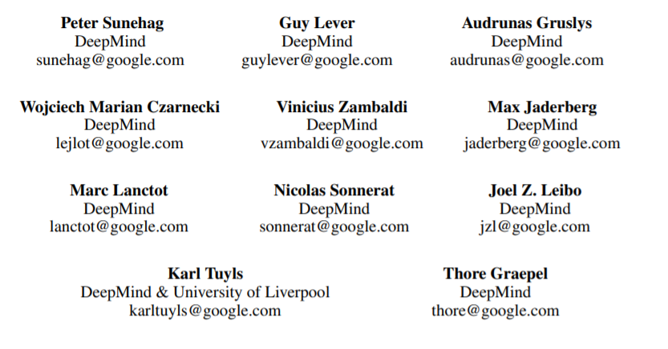

* awsl 
{:toc}

# 期刊/会议列表

| 名字                                                         | 缩写           | 说明                                                         | 等级                                              | url                                                          | 备注 |
| ------------------------------------------------------------ | -------------- | ------------------------------------------------------------ | ------------------------------------------------- | ------------------------------------------------------------ | ---- |
| Proceedings of Machine Learning Research  Journal of Machine Learning Research | PMLR JMLR | PMLR是JMLR的论文集                                           | 中科院3区 CCF-A                              | https://proceedings.mlr.press/ http://dblp.uni-trier.de/db/journals/jmlr/ |      |
| [2021 IEEE/RSJ International Conference on Intelligent Robots and Systems (IROS)](https://ieeexplore.ieee.org/xpl/conhome/9635848/proceeding) | IROS           | 智慧型機器人與系統國際會議                                   | CCF（中国计算机学会推荐国际学术会议-人工智能）C类 | https://ieeexplore.ieee.org/xpl/conhome/9635848/proceeding   |      |
| Annual Conference on Neural Information Processing Systems | NeurIPS        |                                                              | CCF（中国计算机学会推荐国际学术会议-人工智能）A类 | http://dblp.uni-trier.de/db/conf/nips/                       |      |
| Journal of Ambient Intelligence and Humanized Computing      |                |  中科院分区，右键在新窗口打开图片 | 中科院3区                                         |                                                              |      |
| SOFT COMPUTING                                               |                |                                                              | 中科院3区 CCF-C                              |                                                              |      |
| [Computer Networks](https://www.sciencedirect.com/journal/computer-networks) |                |                                                              | 中科院3区 CCF-B                              |                                                              |      |
| [AAMAS](https://dl.acm.org/doi/proceedings/10.5555/3237383)  |                |                                                              | CCF-B                                             |                                                              |      |

# 论文列表

## 1 Scalable Reinforcement Learning of Localized Policies for Multi-Agent Networked Systems

| 名字                                                         | Scalable Reinforcement Learning of Localized Policies for Multi-Agent Networked Systems |
| ------------------------------------------------------------ | ------------------------------------------------------------ |
| 来源                                                         | Proceedings of Machine Learning Research vol. 120:1–11, 2020 2nd Annual Conference on Learning for Dynamics and Control |
| url                                                          | https://arxiv.org/abs/1912.02906 https://proceedings.mlr.press/v120/qu20a.html |
| 进度                                                         | 5%，看了个摘要，还没看懂                                     |
| 描述论文：（要解决什么问题？解决问题的方法是什么？结果如何？） |                                                              |
| 启发/学到了什么                                              |                                                              |
| 阅读日期                                                     | 2022-09-03第一次下载                                         |
| 是否有博客记录                                               | 暂无                                                         |
| 作者和机构                                                   | Guannan Qu GQU@CALTECH.EDU Adam Wierman ADAMW@CALTECH.EDU California Institute of Technology, Pasadena, CA 91125, USA Na Li NALI@SEAS.HARVARD.EDU Harvard University, Cambridge, MA 02138, USA Editors: A. Bayen, A. Jadbabaie, G. J. Pappas, P. Parrilo, B. Recht, C. Tomlin, M. Zeilinger |
| 发表日期                                                     | 2020                                                         |
| cite                                                         | Qu, G., Wierman, A. &amp; Li, N.. (2020). Scalable Reinforcement Learning of Localized Policies for Multi-Agent Networked Systems. <i>Proceedings of the 2nd Conference on Learning for Dynamics and Control</i>, in <i>Proceedings of Machine Learning Research</i> 120:256-266 Available from https://proceedings.mlr.press/v120/qu20a.html . |

## 2 Scalable Reinforcement Learning Policies for Multi-Agent Control

| 名字                                                         | Scalable Reinforcement Learning Policies for Multi-Agent Control |
| ------------------------------------------------------------ | ------------------------------------------------------------ |
| 来源                                                         | IROS                                                         |
| url                                                          | https://arxiv.org/abs/2011.08055 https://ieeexplore.ieee.org/document/9636344 |
| 进度                                                         |                                                              |
| 描述论文：（要解决什么问题？解决问题的方法是什么？结果如何？） |                                                              |
| 启发/学到了什么                                              |                                                              |
| 阅读日期                                                     | 2022-09-03第一次下载                                         |
| 是否有博客记录                                               | 暂无                                                         |
| 作者和机构                                                   | [Christopher D. Hsu](https://arxiv.org/search/cs?searchtype=author&query=Hsu%2C+C+D), [Heejin Jeong](https://arxiv.org/search/cs?searchtype=author&query=Jeong%2C+H), [George J. Pappas](https://arxiv.org/search/cs?searchtype=author&query=Pappas%2C+G+J), [Pratik Chaudhari](https://arxiv.org/search/cs?searchtype=author&query=Chaudhari%2C+P) |
| 发表日期                                                     | 2021                                                         |
| cite                                                         | C. D. Hsu, H. Jeong, G. J. Pappas and P. Chaudhari, "Scalable Reinforcement Learning Policies for Multi-Agent Control," 2021 IEEE/RSJ International Conference on Intelligent Robots and Systems (IROS), 2021, pp. 4785-4791, doi: 10.1109/IROS51168.2021.9636344. |

## 3 Scalable Multi-Agent Reinforcement Learning for Networked Systems with Average Reward

| 名字                                                         | Scalable Scalable Multi-Agent Reinforcement Learning for Networked Systems with Average Reward |
| ------------------------------------------------------------ | ------------------------------------------------------------ |
| 来源                                                         | [NeurIPS](https://proceedings.neurips.cc/)                   |
| url                                                          | https://proceedings.neurips.cc/paper/2020/hash/168efc366c449fab9c2843e9b54e2a18-Abstract.html https://proceedings.neurips.cc//paper/2020/file/168efc366c449fab9c2843e9b54e2a18-Paper.pdf |
| 进度                                                         |                                                              |
| 描述论文：（要解决什么问题？解决问题的方法是什么？结果如何？） |                                                              |
| 启发/学到了什么                                              | 可扩展性（scalability）问题的含义                            |
| 阅读日期                                                     | 2022-09-03第一次下载                                         |
| 是否有博客记录                                               | 暂无                                                         |
| 作者和机构                                                   | Guannan Qu Caltech, Pasadena, CA gqu@caltech.edu Yiheng Lin Tsinghua University, Beijing, China linyh16@mails.tsinghua.edu.cn Adam Wierman Caltech, Pasadena, CA adamw@caltech.edu Na Li Harvard University, Cambridge, MA 02138 nali@seas.harvard.edu |
| 发表日期                                                     | 2020                                                         |
| cite                                                         | Guannan Qu, Yiheng Lin, Adam Wierman, and Na Li. 2020. Scalable multi-agent reinforcement learning for networked systems with average reward. In Proceedings of the 34th International Conference on Neural Information Processing Systems (NIPS'20). Curran Associates Inc., Red Hook, NY, USA, Article 175, 2074–2086. |

## 4 Bi‑objective cloud resource management for dependent tasks using Q‑learning and NSGA‑3 看完了

| 名字                                                         | Bi‑objective cloud resource management for dependent tasks using Q‑learning and NSGA‑3 |
| ------------------------------------------------------------ | ------------------------------------------------------------ |
| 来源                                                         | Journal of Ambient Intelligence and Humanized Computing      |
| url                                                          | https://link.springer.com/article/10.1007/s12652-022-03885-y#citeas |
| 进度                                                         | 100%                                                         |
| 描述论文：（要解决什么问题？解决问题的方法是什么？结果如何？） | 1. 为了解决可伸缩性问题，状态空间可能是指数级别。 2. 用了两个独立的Q学习，两个Q对应两个目标，选择动作进行一次状态转移时：如果两个目标的reward都变好，那就保留这个状态转移；如果两个目标的reward都变差，那么就不保留这个状态转移；如果一个好一个坏，就再来一次重新选动作。 3. 除此之外还有一个long-term学习，因为之前两个Q的时候只训练一部分的任务（所有前驱都完成的任务，但不是所有的任务），就把每一部分的最优解都放到全局调度里面再算Q值，然后挑在全局调度中做的最好的。 4. 结果没什么别的亮点，就是正常的和其他算法比较了一下。 |
| 启发/学到了什么                                              | 删除没用的状态减少搜索空间（这个还挺有用），把部分调度放到全局调度去考虑最优解（这一块不太清楚别的任务调度是怎么做的，还得再总结论文看看） 有个点不太懂，那个两个Q网络其实就是单独的自己做自己的，这也能叫multi-agent？ |
| 阅读日期                                                     | 2022-09-03第一次阅读 2022-09-04第二次阅读 2022-09-05~2022-09-12断断续续看完了 |
| 是否有博客记录                                               | 暂无，有组会汇报ppt，汇报日期2022-09-13                      |
| 作者和机构                                                   | Ali Asghari1 · Mohammad Karim Sohrabi1                       |
| 发表日期                                                     | 2022                                                         |
| cite                                                         | Asghari, A., Sohrabi, M.K. Bi-objective cloud resource management for dependent tasks using Q-learning and NSGA-3. *J Ambient Intell Human Comput* (2022). https://doi.org/10.1007/s12652-022-03885-y |

## 5 Online scheduling of dependent tasks of cloud’s workflows to enhance resource utilization and reduce the makespan using multiple reinforcement learning-based agents

| 名字                                                         | Online scheduling of dependent tasks of cloud’s workflows to enhance resource utilization and reduce the makespan using multiple reinforcement learning-based agents |
| ------------------------------------------------------------ | ------------------------------------------------------------ |
| 来源                                                         | [Soft Computing](https://www.springer.com/journal/500/)      |
| url                                                          | https://link.springer.com/article/10.1007/s00500-020-04931-7 |
| 进度                                                         | 2022-09-04第一次下载                                         |
| 描述论文：（要解决什么问题？解决问题的方法是什么？结果如何？） |                                                              |
| 启发/学到了什么                                              |                                                              |
| 阅读日期                                                     |                                                              |
| 是否有博客记录                                               | 暂无                                                         |
| 作者和机构                                                   | Ali Asghari1 • Mohammad Karim Sohrabi1 • Farzin Yaghmaee1,2  |
| 发表日期                                                     | 2020                                                         |
| cite                                                         | Asghari, A., Sohrabi, M.K. & Yaghmaee, F. Online scheduling of dependent tasks of cloud’s workflows to enhance resource utilization and reduce the makespan using multiple reinforcement learning-based agents. *Soft Comput* **24**, 16177–16199 (2020). https://doi.org/10.1007/s00500-020-04931-7 |

## 6 A cloud resource management framework for multiple online scientific workflows using cooperative reinforcement learning agents

| 名字                                                         | A cloud resource management framework for multiple online scientific workflows using cooperative reinforcement learning agents |
| ------------------------------------------------------------ | ------------------------------------------------------------ |
| 来源                                                         | [Computer Networks](https://www.sciencedirect.com/journal/computer-networks) |
| url                                                          | https://www.sciencedirect.com/science/article/pii/S1389128619305791 |
| 进度                                                         |                                                              |
| 描述论文：（要解决什么问题？解决问题的方法是什么？结果如何？） |                                                              |
| 启发/学到了什么                                              |                                                              |
| 阅读日期                                                     | 2022-09-04第一次下载                                         |
| 是否有博客记录                                               | 暂无                                                         |
| 作者和机构                                                   | Ali Asghari a , Mohammad Karim Sohrabi a,∗ , Farzin Yaghmaee a,b a Department of Computer Engineering, Semnan Branch, Islamic Azad University, Semnan, Iran b Electrical and Computer Engineering Department, Semnan University, Iran |
| 发表日期                                                     | 2020                                                         |
| cite                                                         | Ali Asghari, Mohammad Karim Sohrabi, Farzin Yaghmaee, A cloud resource management framework for multiple online scientific workflows using cooperative reinforcement learning agents, Computer Networks, Volume 179, 2020, 107340, ISSN 1389-1286, https://doi.org/10.1016/j.comnet.2020.107340. |

## 7 QMIX: Monotonic Value Function Factorisation for Deep Multi-Agent Reinforcement Learning

| 名字                                                         | [Qmix: Monotonic value function factorisation for deep multi-agent reinforcement learning](http://proceedings.mlr.press/v80/rashid18a.html) |
| ------------------------------------------------------------ | ------------------------------------------------------------ |
| 来源                                                         | ICML                                                         |
| url                                                          | http://proceedings.mlr.press/v80/rashid18a.html              |
| 进度                                                         |                                                              |
| 描述论文：（要解决什么问题？解决问题的方法是什么？结果如何？） |                                                              |
| 启发/学到了什么                                              |                                                              |
| 阅读日期                                                     | 2022/9/13 download                                           |
| 是否有博客记录                                               |                                                              |
| 作者和机构                                                   | **Tabish Rashid, Mikayel Samvelyan, Christian Schroeder, Gregory Farquhar, Jakob Foerster, Shimon Whiteson** |
| 发表日期                                                     | 2018                                                         |
| cite                                                         | Rashid, T., Samvelyan, M., Schroeder, C., Farquhar, G., Foerster, J. &amp; Whiteson, S.. (2018). QMIX: Monotonic Value Function Factorisation for Deep Multi-Agent Reinforcement Learning. <i>Proceedings of the 35th International Conference on Machine Learning</i>, in <i>Proceedings of Machine Learning Research</i> 80:4295-4304 Available from https://proceedings.mlr.press/v80/rashid18a.html. |

## 8 Value-Decomposition Networks For Cooperative Multi-Agent Learning Based On Team Reward

| 名字                                                         | Value-Decomposition Networks For Cooperative Multi-Agent Learning Based On Team Reward |
| ------------------------------------------------------------ | ------------------------------------------------------------ |
| 来源                                                         | [AAMAS '18: Proceedings of the 17th International Conference on Autonomous Agents and MultiAgent Systems](https://dl.acm.org/doi/proceedings/10.5555/3237383) |
| url                                                          | https://dl.acm.org/doi/10.5555/3237383.3238080               |
| 进度                                                         |                                                              |
| 描述论文：（要解决什么问题？解决问题的方法是什么？结果如何？） |                                                              |
| 启发/学到了什么                                              |                                                              |
| 阅读日期                                                     | 2022/09/13 download                                          |
| 是否有博客记录                                               |                                                              |
| 作者和机构                                                   |  |
| 发表日期                                                     | 2018                                                         |
| cite                                                         | Peter Sunehag, Guy Lever, Audrunas Gruslys, Wojciech Marian Czarnecki, Vinicius Zambaldi, Max Jaderberg, Marc Lanctot, Nicolas Sonnerat, Joel Z. Leibo, Karl Tuyls, and Thore Graepel. 2018. Value-Decomposition Networks For Cooperative Multi-Agent Learning Based On Team Reward. In Proceedings of the 17th International Conference on Autonomous Agents and MultiAgent Systems (AAMAS '18). International Foundation for Autonomous Agents and Multiagent Systems, Richland, SC, 2085–2087. |

## 序号 标题

| 名字                                                         |      |
| ------------------------------------------------------------ | ---- |
| 来源                                                         |      |
| url                                                          |      |
| 进度                                                         |      |
| 描述论文：（要解决什么问题？解决问题的方法是什么？结果如何？） |      |
| 启发/学到了什么                                              |      |
| 阅读日期                                                     |      |
| 是否有博客记录                                               |      |
| 作者和机构                                                   |      |
| 发表日期                                                     |      |
| cite                                                         |      |

